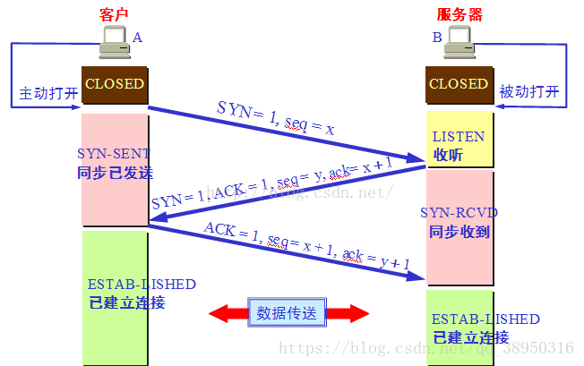
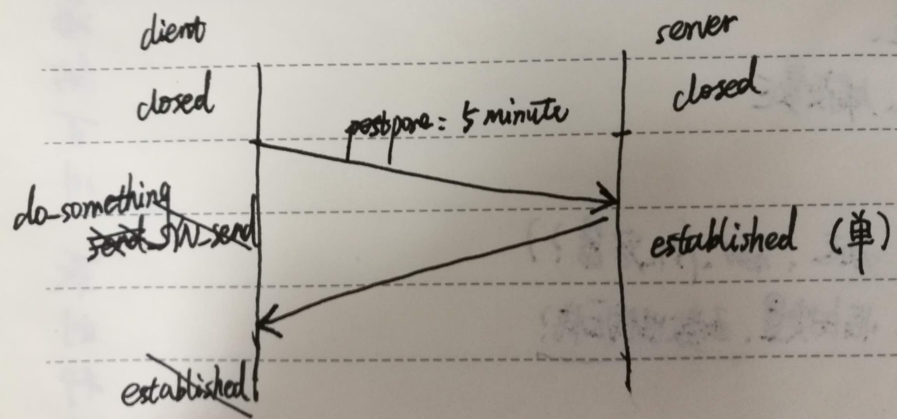
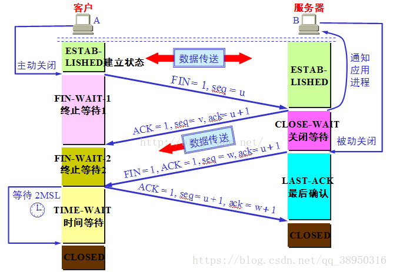

### 三次握手是怎么样的？

1. 第一次客户端向服务端发送连接请求，SYN=1;
2. 第二次服务端回复客户端的请求，表示服务端准备好建立来接，SYN=1, ACK=1;
3. 第三次客户端回复并建立连接，ACK=1;

### 为什么需要三次握手，两次不可以吗？

> 在谢希仁著《计算机网络》第四版中讲“三次握手”的目的是“**为了防止已失效的连接请求报文段突然又传送到了服务端，因而产生错误**”。在另一部经典的《计算机网络》一书中讲“三次握手”的目的是为了解决“网络中存在延迟的重复分组”的问题。这两种不用的表述其实阐明的是同一个问题。
>
> 谢希仁版《计算机网络》中的例子是这样的，“已失效的连接请求报文段”的产生在这样一种情况下：client发出的第一个连接请求报文段并没有丢失，而是在某个网络结点长时间的滞留了，以致延误到连接释放以后的某个时间才到达server。本来这是一个早已失效的报文段。但server收到此失效的连接请求报文段后，就误认为是client再次发出的一个新的连接请求。于是就向client发出确认报文段，同意建立连接。假设不采用“三次握手”，那么只要server发出确认，新的连接就建立了。由于现在client并没有发出建立连接的请求，因此不会理睬server的确认，也不会向server发送数据。但server却以为新的运输连接已经建立，并一直等待client发来数据。这样，server的很多资源就白白浪费掉了。采用“三次握手”的办法可以防止上述现象发生。例如刚才那种情况，client不会向server的确认发出确认。server由于收不到确认，就知道client并没有要求建立连接。”。主要目的防止server端一直等待，浪费资源。

### 四次挥手是怎么样的？

+ `FIN_WAIT_1`: 这个状态要好好解释一下，其实FIN_WAIT_1和FIN_WAIT_2状态的真正含义都是表示等待对方的FIN报文。而这两种状态的区别是：FIN_WAIT_1状态实际上是当SOCKET在ESTABLISHED状态时，它想主动关闭连接，向对方发送了FIN报文，此时该SOCKET即进入到FIN_WAIT_1状态。而当对方回应ACK报文后，则进入到FIN_WAIT_2状态，当然在实际的正常情况下，无论对方何种情况下，都应该马上回应ACK报文，所以FIN_WAIT_1状态一般是比较难见到的，而FIN_WAIT_2状态还有时常常可以用netstat看到。（主动方）
+ `FIN_WAIT_2`：上面已经详细解释了这种状态，实际上FIN_WAIT_2状态下的SOCKET，表示半连接，也即有一方要求close连接，但另外还告诉对方，我暂时还有点数据需要传送给你(ACK信息)，稍后再关闭连接。（主动方）
+ `TIME_WAIT`: 表示收到了对方的FIN报文，并发送出了ACK报文，就等2MSL后即可回到CLOSED可用状态了。如果FIN_WAIT_1状态下，收到了对方同时带FIN标志和ACK标志的报文时，可以直接进入到TIME_WAIT状态，而无须经过FIN_WAIT_2状态。（主动方）
+ `CLOSING（比较少见）`: 这种状态比较特殊，实际情况中应该是很少见，属于一种比较罕见的例外状态。正常情况下，当你发送FIN报文后，按理来说是应该先收到（或同时收到）对方的 ACK报文，再收到对方的FIN报文。但是CLOSING状态表示你发送FIN报文后，并没有收到对方的ACK报文，反而却也收到了对方的FIN报文。什么情况下会出现此种情况呢？其实细想一下，也不难得出结论：那就是如果双方几乎在同时close一个SOCKET的话，那么就出现了双方同时发送FIN报文的情况，也即会出现CLOSING状态，表示双方都正在关闭SOCKET连接。
+ `CLOSE_WAIT`: 这种状态的含义其实是表示在等待关闭。怎么理解呢？当对方close一个SOCKET后发送FIN报文给自己，你系统毫无疑问地会回应一个ACK报文给对方，此时则进入到CLOSE_WAIT状态。接下来呢，实际上你真正需要考虑的事情是察看你是否还有数据发送给对方，如果没有的话，那么你也就可以 close这个SOCKET，发送FIN报文给对方，也即关闭连接。所以你在CLOSE_WAIT状态下，需要完成的事情是等待你去关闭连接。（被动方）
+ `LAST_ACK`: 这个状态还是比较容易好理解的，它是被动关闭一方在发送FIN报文后，最后等待对方的ACK报文。当收到ACK报文后，也即可以进入到CLOSED可用状态了。（被动方）
+ `CLOSED`: 表示连接中断。

### 为什么需要四次握手？

1. TCP是全双工模式，支持半关闭
2. 确保数据能够完成传输。

> 当Server端收到FIN报文时，很可能并不会立即关闭SOCKET，所以只能先回复一个ACK报文，告诉Client端，"你发的FIN报文我收到了"。只有等到我Server端所有的报文都发送完了，我才能发送FIN报文，因此不能一起发送。故需要四步握手。

总的来说，因为TCP的目标是提供可靠传输，所以设计时充分考虑了时延，丢包等情况（健壮性）；TCP是端对端一对一的，所以要对对方发送的每一个包进行响应，全双工在考虑发送的同时也要考虑接收的问题。

### time_wait

1、为了保证客户端发送的最后一个ACK报文段能够到达服务器。因为这个ACK有可能丢失，从而导致处在LAST-ACK状态的服务器收不到对FIN-ACK的确认报文。服务器会超时重传这个FIN-ACK，接着客户端再重传一次确认，重新启动时间等待计时器。最后客户端和服务器都能正常的关闭。假设客户端不等待2MSL，而是在发送完ACK之后直接释放关闭，一但这个ACK丢失的话，服务器就无法正常的进入关闭连接状态。

2、他还可以防止已失效的报文段。客户端在发送最后一个ACK之后，再经过经过2MSL，就可以使本链接持续时间内所产生的所有报文段都从网络中消失。从保证在关闭连接后不会有还在网络中滞留的报文段去骚扰服务器。

    如果不等，释放的端口可能会重连刚断开的服务器端口，这样依然存活在网络里的老的TCP报文可能与新TCP连接报文冲突，造成数据冲突，为避免此种情况，需要耐心等待网络老的TCP连接的活跃报文全部死翘翘，2MSL时间可以满足这个需求（尽管非常保守）！

参考：  
[三次握手四次挥手](https://blog.csdn.net/xifeijian/article/details/12777187)  
[三次握手四次挥手](https://blog.csdn.net/qq_38950316如果不等，释放的端口可能会重连刚断开的服务器端口，这样依然存活在网络里的老的TCP报文可能与新TCP连接报文冲突，造成数据冲突，为避免此种情况，需要耐心等待网络老的TCP连接的活跃报文全部死翘翘，2MSL时间可以满足这个需求（尽管非常保守）！