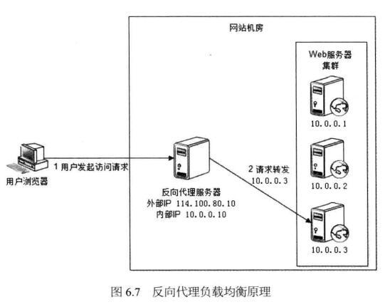
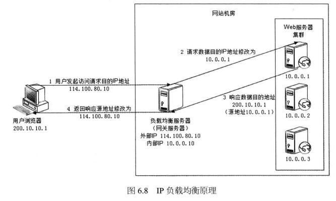

## 负载均衡

负载均衡有硬件和软件两种.硬件层的比较牛逼,将4-7层负载均衡功能做到一个硬件里面,如F5,梭子鱼,据说yahoo中国!早些时候只用了两台F5做双活.目前主流的软件负载均衡分为四层和七层.LVS属于四层负载均衡,工作在tcp/ip协议栈上,通过修改网络包的ip地址和端口来转发, 由于效率比七层高,一般放在架构的前端.七层的负载均衡有nginx, haproxy, apache等, 工作在应用层,因此可以将HTTP请求等应用数据发送到具体的应用服务器,如将图片请求转发到特定的服务器上,总之可以做到更智能的负载均衡，这些功能在四层负载均衡上不好实现,一般放在架构的后面位置,布置在应用服务器前面.

### 反向代理负载均衡

反向代理服务器的核心工作是转发HTTP，它工作在HTTP层面，因此，基于反向代理的负载均衡也称为七层负载均衡。
任何对于实际服务器的HTTP请求都必须经过调度器；调度器必须等待实际服务器的HTTP响应，并将它反馈给用户。

### IP负载均衡

网络地址转换(NAT)负载均衡工作在传输层，对数据包中的IP地址和端口进行修改，从而达到转发的目的，称为四层负载均衡。
NAT服务器（前端服务器）必须作为实际服务器（后端服务器）的网关，否则数据包被转发后将一去不返。

### IP隧道

基于IP隧道的负载均衡系统也可以使用LVS来实现，称为LVS-TUN。与LVS-DR不同的是，实际服务器和调度器可以不在同一个WAN网段，调度器通过IP隧道技术来转发请求到实际服务器，所以实际服务器必须有合法的IP地址。基于IP隧道的请求转发机制，是将调度器收到的IP数据包封装在一个新的IP数据包中，转交给实际服务器，然后实际服务器的响应数据包可以直接到达用户端。基于IP隧道的独特方式，可以将实际服务器部署在不同的地域并根据就近原则转移请求，比如一些CDN服务器就是基于IP隧道技术实现的。

### DNS负载均衡

参考：
[知乎负载均衡原理](https://www.zhihu.com/question/22610352)