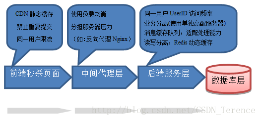

#### 如何设计一个高并发的系统

+ 数据库优化，包括合理的事务隔离级别、SQL语句优化、索引的优化；
+ 使用缓存，尽量减少数据库IO
+ 分布式数据库、分布式缓存
+ 服务器负载均衡

#### 设计一个秒杀系统？

参考：
<https://blog.csdn.net/CSDN_Terence/article/details/77744042>
[系统设计入门](https://github.com/pioneerlfn/system-design-primer/blob/master/README-zh-Hans.md)