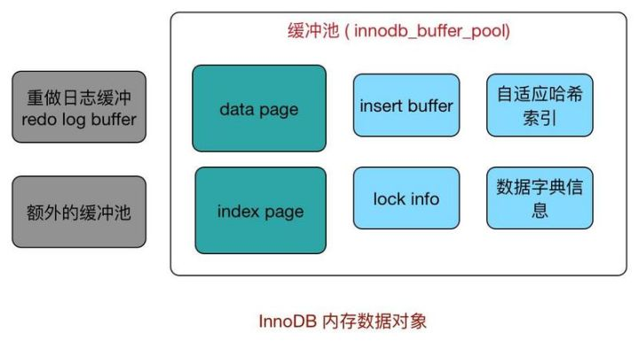
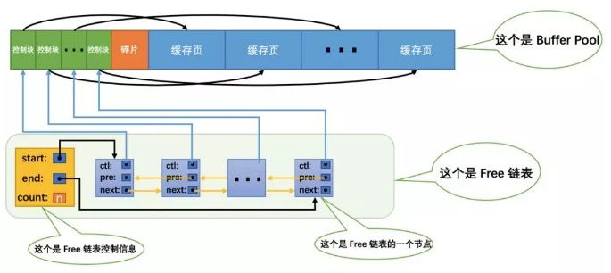

#### 缓冲池

free list, LRU list, flush list

#### checkpoint机制

目的：

1.缩短数据库恢复时间：宕机时只需要对checkpoint以后的redo日志进行恢复，之前的已经刷新回磁盘。  
2.缓冲池不够用时，将脏页刷新回磁盘：如果LRU淘汰的页是脏页，则强制执行checkpoint。  
3.redo日志不可用是，刷新脏页：保证redo日志循环使用。  

做什么：
将缓存池中的脏页刷回磁盘

类型：

+ sharp checkpoint：数据库关闭时脏页写回
+ fuzzy checkpoint：数据库运行时，
  + Master Tread checkpoint：定时刷新
  + flush lru list checkpoint：换页刷新
  + Async/sync flush checkpoint：redo日志覆盖刷新
  + dirty page too much checkpoint：脏页过多刷新

#### 插入缓冲

[聚集索引和非聚集索引](https://mp.weixin.qq.com/s?__biz=MzU4NjQwNTE5Ng==&mid=2247483881&idx=1&sn=e86e0f314db7cc6acb4ba54334d8c87e&chksm=fdfa85caca8d0cdc0fcc0aec377b391fdc66dd61e6176af3b5c16d4e2c9db52cab173d21814d#rd)
[插入缓存机制](https://zhuanlan.zhihu.com/p/39812854)

#### 两次写机制

提高可靠性，刷新时并不直接写数据文件，而是将脏页写到磁盘的共享表区间，再写数据文件。（相当于先写一个备份）

#### 自适应哈希索引

哈希查找比B+树查找快。Innodb存储引擎监控各索引页的查询，自动根据访问的频率和模式来自动为某些热点的页建立哈希索引，读写速度提高两倍。

#### 异步IO

#### InnoDB和MyISAM对比

+ InnoDB支持事务，MyISAM不支持；
+ InnoDB数据存储在共享表空间，MyISAM数据存储在文件中；
+ InnoDB支持行级锁，MyISAM只支持表锁；
+ InnoDB支持崩溃后的恢复，MyISAM不支持；
+ InnoDB支持外键，MyISAM不支持；
+ InnoDB不支持全文索引，MyISAM支持全文索引

1.InnoDB存储引擎(支持事务、行级锁、外键、安全恢复，插入更新性能更好,~~不支持全文索引~~)

+ 默认事务型引擎，最重要最广泛的存储引擎，性能非常优秀。
+ 数据存储在共享表空间，可以通过配置分开。也就是多个表和索引都存储在一个表空间中，可以通过配置文件改变此配置。
+ 对主键查询的性能高于其他类型的存储引擎
+ 内部做了很多优化，从磁盘读取数据时会自动构建hash索引，插入数据时自动构建插入缓冲区。
+ 通过一些机制和工具支持真正的热备份。
+ 支持崩溃后的安全恢复。
+ 支持行级锁。
+ 支持外键。

2.MyISAM存储引擎(支持全文索引，查找性能好(某些)，不支持事务、行级锁、外键、安全恢复)

+ 拥有全文索引、压缩、空间函数。
+ 不支持事务和行级锁、不支持崩溃后的安全恢复。
+ 表存储在两个文件，MYD和MYI。
+ 设计简单，某些场景下性能很好，例如获取整个表有多少条数据，性能很高。
+ 全文索引不是很常用，不如使用外部的ElasticSearch或Lucene。

#### 其他引擎

memory， CSV, blackhole

参考：
[一文了解InnoDB存储引擎](https://zhuanlan.zhihu.com/p/47581960)