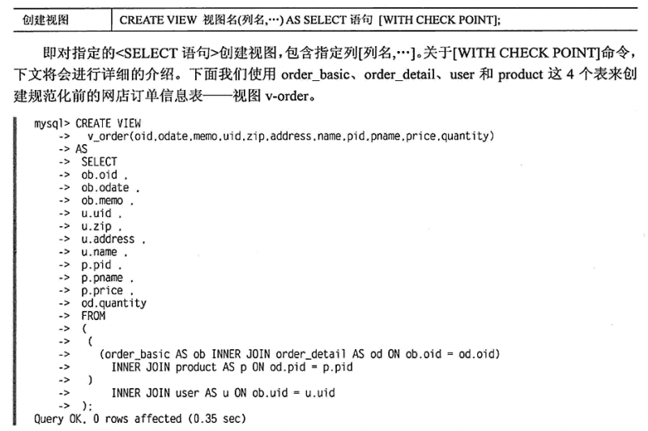

## 1.SQL语句

子查询，多表查询，排序

### 基础语句

+ myql -u root -p --按提示输入密码
+ SHOW databases;
+ DROP database test;
+ CREATE database home;
+ use home;
+ grant all priviledges on home.* to user@localhost identified by '12345'; --创建授权用户
+ SELECT database(); --查看当前数据库
+ mysqladmin -u root -p CREATE home;
+ **mysqladmin -u root -p < sampledb.sql;**
+ **DML(manipulation), DDL(definition), DCL(control)**

+ CREATE table if not exists customer(id INT NOT NULL, birth DATE, title VARCHAR(100) NOT NULL, primary key(id))engine=InnoDB default charset=utf8;
+ CREATE table goods(id INT AUTO_INCREMENT PRIMARY KEY, name VATCHAR(30));
+ **ALTER tables goods AUTO_INCREMENT=0;**
+ SHOW tables;
+ DROP TABLE customerG;
+ desc customer; describe customer;
+ DROP table customer;
+ INSERT into customer(id, title) values(100, 'xiaohua');
+ INSERT into customer values(101, '1990-1-1', 'xiaoming');
+ UNIQUE制约, DEFAULT制约, CHECK制约
+ SELECT * FROM customer；
+ UPDATE customer SET name='', birth='' WHERE TITLE='';
+ DELETE FROM customer WHERE birst='';
+ SELECT name,birth FROM customer WHERE birth>='1990/1/1'; --条件
+ SELECT name,birth FROM customer WHERE name **LIKE '李%'**; --%代笔0个以上字符，_表示一个字符
+ SELECT name,birth FROM customer WHERE birth>='1990/1/1' AND name LIKE '李_'; --多条件
+ SELECT name,birth FROM customer WHERE birth>='1990/1/1' AND name LIKE '李_', **ORDER BY** sec **ASC**, birth **DESC**; --排序
+ SELECT name,birth FROM customer WHERE birth>='1990/1/1' AND name LIKE '李_', ORDER BY sec ASC, birth DESC **LIMIT 1,2**; --从1开始取2条，limit 2表示从0开始取2条
+ SELECT sex,COUNT(id) FROM customer **GROUP BY** sex; --数据分组，统计男女人数
+ SELECT sex,COUNT(id)*2 AS cnt FROM customer GROUP BY sex; --别名，加减乘除运算
+ 处理算术运算，比较运算等，还提供数据库函数字符串函数，数值函数，日期函数等。
+ SELECT u.name,o.oid FROM order AS o INNER JOIN user AS u **ON** o.uid=u.uid; --内连接
+ [内连接，左外连接，右外连接，自连接](https://blog.csdn.net/plg17/article/details/78758593)
+ SELECT * FROM product WHERE price > (SELECT AVG(price) FROM product); --基本子查询
+ SELECT name,address FROM user WHERE uid **NOT IN** (SELECT uid FROM order WHERE odate=''); --多个返回值的子查询
+ SELECT name,address FROM user WHERE **EXISTS** (SELECT * FROM order WHERE user.uid=order.uid); --查询至少一单的用户
+ SELECT country FROM websites **UNION** SELECT country FROM Apps ORDER BY country; --从两表选出所有不同country,不含重复
+ SELECT country FROM websites **UNION ALL** SELECT country FROM Apps ORDER BY country; --从两表选出所有不同country --包含重复

+ ALTER TABLE visitor MODIFY name VARCHAR(30); --由VARCHAR(20)改为VARCHAR(30)
+ ALTER TABLE visitor ADD old INT；
+ ALTER TABLE visitor ADD old INT FIRST；--加在最前面
+ ALTER TABLE visitor ADD old INT AFTER name；--任意位置
+ ALTER TABLE visitor MODIFY old INT AFTER name; --修改列的位置
+ ALTER TABLE visitor CHANGE birth birthday DATA; --修改列名和属性
+ ALTER TABLE visitor DROP old; --删除列

+ CREATE TABLE customerH SELECT * FROM customer; --复制列结构及数据
+ CREATE TABLE customerH **LIKE** customer; --复制列结构，包括PRIMARY KEY和AUTO_INCREMENT
+ INSERT INTO customerH SELECT * FROM customer; --复制数据

### SQL语句拓展

1.`SELECT u.name,o.oid FROM order AS o INNER JOIN user AS u **ON** o.uid=u.uid;`  SQL语句中`AS`可以忽略，使用别名后就必须使用别名，如写`user.name`则报错找不到user。

2.[sql四大排序函数](https://www.cnblogs.com/52XF/p/4209211.html)，mysql没有rank函数。

3.`select *,ROW_NUMBER() over(partition by Course order by Score DESC)排名 from UserGrade` 思路:根据学科分组,根据成绩排序,使用分区函数`partition by`

4.<https://leetcode.com/problems/second-highest-salary/discuss/52952/A-Simple-Answer>

5.get the nth highest salary from the Employee table b

```sql
CREATE FUNCTION getNthHighestSalary(N INT) RETURNS INT
BEGIN
DECLARE M INT; --冒号结束
SET M=n-1;
  RETURN (
      # Write your MySQL query statement below.
      SELECT DISTINCT Salary FROM Employee ORDER BY Salary DESC limit M,1 --无冒号
  );
END
```

6.[mysql实现rank函数](https://blog.csdn.net/justry_deng/article/details/80597916)

7.<https://leetcode.com/problems/rank-scores/submissions/>

```sql
SELECT
  Score,
  convert(if(@prev <> (@prev := Score), @rank := @rank+1, @rank),unsigned) Rank
  --convert 类型转换，if语句返回的是字符串
FROM
  Scores,
  (SELECT @rank := 0, @prev := -1) init
ORDER BY Score desc
```

8.`having`字句可以让我们筛选成组后的各种数据，where字句在聚合前先筛选记录，也就是说作用在group by和having字句前。而having子句在聚合后对组记录进行筛选。

9.[select子查询](https://blog.csdn.net/JesseYoung/article/details/40108781)

## 2.transaction

+ SHOW CREATE TABLE customer; --查看包括存储引擎
+ SHOW CREATE TABLE customer \G --用\G替换分号是监视器的小技巧，方便查看
+ ALTER TABLE customer ENGINE=MyISAM;
+ transaction事务：BEGIN,COMMIT,ROLLBACK，提交前可以回滚，提交后不可以。
+ SET AUTOCOMMIT=0; --关闭自动提交
+ SELECT @@AUTOCOMMIT; --查看自动提交模式
+ SAVEPOINT sp; ROLLBACK TO SAVEPOINT sp;

+ drop database; drop table; drop; alter table; 这几个命令执行后会自动commit，不在事务处理范围之内。
+ 锁：共享锁（读锁），排他锁（写锁），粒度：行，表，库。
+ 不是锁的粒度越小越好，因为锁要消耗数据库服务器资源，锁数目越多消耗资源越多。mysql不支持库粒度，不支持锁提升。
+ 事务隔离级别；READ UNCOMMITED, READ COMMITTED, REPEATABLE READ（mysql默认级别）, SERIALIZABLE
+ 隔离性越高，锁定时间越长，性能降低。
+ 死锁时数据库采取将一方锁定强制解除，并rollback。

| 隔离水平 | 非提交读 | 不可重复读 | 幻象读 |
| ----- | ----- | ------| --- |
| READ UNCOMMITTED | YES | YES | YES |
| READ COMMITTED   | NO  | YES | YES |
| REPEATABLE READ  | NO  | NO  | YES |
| SERIALIZABLE     | NO  | NO  | NO  |

### 事务更新数据

(1)UNDO日志：回滚段，在修改数据之前保存变更前的数据，表内容有指向undo日志的指针。  
(2)REDO日志：事务处理日志，commit后出错，利用redo日志恢复。客户端更新数据先更新内存，同时将事务写到REDO日志（实时），到达某一检查点是更新硬盘数据。如果写硬盘出错（如断电导致内存丢失），则排除故障并可根据REDO日志还原到故障点前。

## 3.索引与视图

+ CREATE INDEX idxlp ON employee(lname_pinyin); --对表employee的lname_pinyin列建立索引名为idxlp
+ SHOW INDEX FROM employee\G
+ DROP INDEX idxlp ON employee;
+ CREATE UNIQUE INDEX idx_lname ON employee(lname, fname); --复合索引和唯一索引
+ **EXPLAIN** SELECT * FROM employee WHERE lname_pinyin='wang'\G
+ CREATE VIEW 视图名(列名) AS SELECT语句 [WITH CHECK POINT];
+ CREATE OR REPLACE VIEW 视图名 AS SELECT语句;
+ DROP VIEW v_order;
+ SHOW TABLES; --会将视图与表混在一起
+ `SHOW TABLES LIKE 'V\_%';` --给视图具有特征的命名
+ SHOW FIELDS FROM v_order;
+ SELECT * FROM v_order WHERE oid='';

丛生索引？  
唯一索引：含有重复数据则报错  
创建索引的目的是提高搜索效率，如果遍历的次数与创建索引前变化不大，说明创建索引不合理。

### 索引失效

+ 使用LIKE模糊匹配时，进行后方一致或部分一致检索不能使用索引；
+ 使用IS NOT NULL、<>比较运算符；
+ 对索引列使用给运算或函数；
+ 复合索引的第一列没包含在WHERE语句中。

### 索引选择

+ 较频繁作为查询字段；
+ 唯一型太差的字段不适合；
+ 更新频繁的字段不适合；
+ 不作为WHERE条件查询的字段不适合；

表如何设计？

### 视图

视图本质是将select语句的检索结果用表的形式保存下来（假表），纯粹的条件索引，视图本身不包含数据，用户可以像使用普通物理表一样使用。视图作用包括：

+ 可以公开特定的行或列，达到权限控制管理；
+ 简化复杂的sql查询，查询代码分割简化；
+ 限制可插入/更新的范围；
+ 修改表中的数据后，视图对应的假表会跟着变化；
+ 视图的select限制：不能包含子查询，不能包含系统变量或用户变量；
+ [with check point]选项规定修改操作必须符合视图的检索条件；
+ 使用视图简化了SELECT语句，但不意味着简化内部的处理；

对视图进行数据插入、更新、删除操作与表一样，但某些情况下不能执行修改：

+ 视图列中函数有统计函数；
+ 视图定义了GROUP BY/HAVING语句，DISTINCT语句，UNION语句；
+ 视图使用子查询；
+ 跨表修改；



## 4.存储过程

使用各种条件判断，循环控制等将一些sql命令组织起来形成程序，实现简单的sql语句不能实现的功能。可以提高性能，减轻网络负担，防止对表的直接访问，将数据库的处理黑盒化。

```sql
DELIMITER // --将分割符改为//
CREATE PROCEDURE 存储名称(参数种类IN/OUT 参数名 参数类型)
BEGIN
  处理内容
END
//
```

## 5.函数与触发器

```sql
CREATE FUNCTION 函数名(参数，数据类型)
RETURNS 返回类型
BEGIN
  sql语句
  RETURN 返回值;
END
```

```sql
CREATE TRIGGER 触发器名 发生时刻 时间名
  ON 表明 FOR EACH ROW
BEGIN
  SQL语句
END
```


+ SHOW PROCEDURE STATUS\G
+ SHOW FUNCTION STATUS\G
+ SHOW TRIGGERS\G

my.init文件和my.cnf文件？