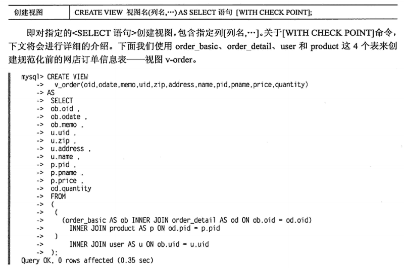

#### 索引的作用

一，大大加快数据的检索速度，这也是创建索引的最主要的原因；
二，保证数据库表中每一行数据的唯一性；
三，可以加速表和表之间的连接，特别是在实现数据的参考完整性方面特别有意义；
四，在使用分组和排序子句进行数据检索时，同样可以显著减少查询中分组和排序的时间；
五，通过使用索引，可以在查询的过程中，使用优化隐藏器，提高系统的性能。

#### 索引的缺点

一，表的增删改查、创建索引和维护索引要耗费时间，降低写速度；
二，索引需要占物理空间；

#### 索引选择

+ 较频繁作为查询字段；
+ 唯一型太差的字段不适合；
+ 更新频繁的字段不适合；
+ 不作为WHERE条件查询的字段不适合；

#### 索引失效

+ 使用LIKE模糊匹配时，进行后方一致或部分一致检索不能使用索引；
+ 使用IS NOT NULL、<>比较运算符；
+ 对索引列使用给运算或函数；
+ 复合索引的第一列没包含在WHERE语句中。

#### 索引分类

数据库索引的两个特征：索引有两个特征，即唯一性索引和复合索引；
①唯一性索引保证在索引列中的全部数据是唯一的，不会包含冗余数据；
②复合索引就是一个索引创建在两个列或者多个列上，搜索时需要两个或者多个索引列作为一个关键值；

数据库索引好比是一本书前面的目录，索引分为聚簇索引和非聚簇索引两类：
1）聚簇索引是按照数据存放的物理位置为顺序的，其多个连续行的访问速度更快；
2）非聚簇索引是按照数据存放的逻辑位置为顺序的，其单行访问速度更快；

### 索引使用

+ 对于非常小的表，大部分情况下全表扫描效率更高。
+ 中到大型表，索引非常有效。
+ 特大型的表，建立和使用索引的代价会随之增大，可以使用分区技术来解决。

### 索引优化

最左前缀匹配原则
主键外检一定索引
选择不重复的列做索引
索引列不计算
尽量扩展索引，不要新建索引

### 视图

视图本质是将select语句的检索结果用表的形式保存下来（假表），纯粹的条件索引，视图本身不包含数据，用户可以像使用普通物理表一样使用。视图作用包括：

+ 可以公开特定的行或列，达到权限控制管理；
+ 简化复杂的sql查询，查询代码分割简化；
+ 限制可插入/更新的范围；
+ 修改表中的数据后，视图对应的假表会跟着变化；
+ 视图的select限制：不能包含子查询，不能包含系统变量或用户变量；
+ [with check point]选项规定修改操作必须符合视图的检索条件；
+ 使用视图简化了SELECT语句，但不意味着简化内部的处理；

对视图进行数据插入、更新、删除操作与表一样，但某些情况下不能执行修改：

+ 视图列中函数有统计函数；
+ 视图定义了GROUP BY/HAVING语句，DISTINCT语句，UNION语句；
+ 视图使用子查询；
+ 跨表修改；

