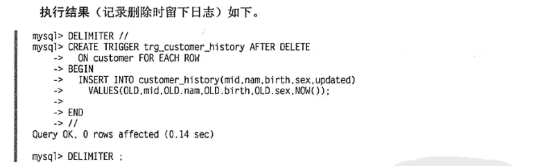

# 触发器

触发器是指一段代码，当触发某个事件时，自动执行这些代码。
触发器是一种与表操作有关的数据库对象，当触发器所在表上出现指定事件时，将调用该对象，即表的操作事件触发表上的触发器的执行。
在MySQL数据库中有如下六种触发器：

+ Before Insert
+ After Insert
+ Before Update
+ After Update
+ Before Delete
+ After Delete

