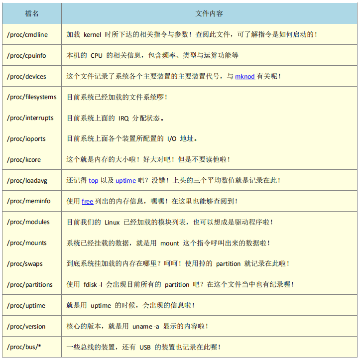

## reference

+ [linux守护进程的启动方法](http://www.ruanyifeng.com/blog/2016/02/linux-daemon.html)
+ [linux工具快速教程](https://linuxtools-rst.readthedocs.io/zh_CN/latest/index.html)
+ [systemd入门](http://www.ruanyifeng.com/blog/2016/03/systemd-tutorial-commands.html)
+ [进程管理](http://gityuan.com/tags/#linux)
+ [进程的内存空间](https://github.com/1184893257/simplelinux/blob/master/mem.md)

## 问题

+ 进程和线程有什么区别？
+ 如何查看有哪些进程和线程？
+ 如何创建进程？如何创建线程？
+ [realid和effectiveid的区别？](https://stackoverflow.com/questions/32455684/difference-between-real-user-id-effective-user-id-and-saved-user-id)

## 基本概念

1.程序，进程，服务：
> 程序(program)：通常为binary program,放置在存储媒体中，为实体文件的形态存在；
> 进程(process)：程序触发后，将执行者权限与属性、程序的代码和所需数据等加载到内存中，操作系统给予这个内存单元一个标识符PID，可以说进程就是一个正在运行的程序。
> 服务(service)：常驻内存的进程通常负责一些系统提供的功能以及服务用户的各项任务，因此这些常驻程序称为服务。

2.进程调用流程（fork and exec）
> linux进程调用通常称为fork-and-exec流程，进程由父进程以复制（fork）的方式产生一个一模一样的子进程，然后被复制的子进程再以exec的方式执行实际要执行的程序，最终称为一个子进程的存在。

3.crontab定时任务（例行性工作排程）

> at指令执行单一排程任务，需要atd服务支持；
> crontab指令执行循环例行性排程，需要crond服务支持。

4.孤儿进程和僵尸进程
>孤儿进程：一个父进程退出，而它的一个或多个子进程还在运行，那么那些子进程将成为孤儿进程。孤儿进程将被init进程(进程号为1)所收养，并由init进程对它们完成状态收集工作。（没什么危害？？）
>僵尸进程：一个进程使用fork创建子进程，如果子进程退出，而父进程并没有调用wait或waitpid获取子进程的状态信息，那么子进程的进程描述符仍然保存在系统中，这种进程称之为僵尸进程。

5.service和daemon
>服务的提供总是需要程序的运行，达成服务的程序称为daemon,所以service和daemon没什么区别。一般服务在linux上使用时通常在名称后加d。

## 工作管理（job control）

1.对于一个终端接口，可以出现提示字符让你操作的环境称为前景（foreground），至于其他工作可以放在背景（background）运行。参考reference中“守护进程的启动方法”。

+ 工作管理的进程必须是shell的子进程（只管理自己的shell）;
+ 前景：可以控制与下达指令的环境；
+ 背景：可以自行运作，不能使用Ctrl-c终止，可使用bg/fg呼叫该工作；
+ 背景中的进程不能等待terminal/shell的输入。

2.工作管理

`&`：直接将指令放在背景执行；
`Ctrl-z`:将目前工作放到背景中暂停；
`jobs -l`:观察目前背景工作的状态，[+]代表最近放到背景的工作号码，可通过`fg`取出，[-]代表最近最后第二个放置到背景的工作号码，超过第三个后不显示；
`fg %jobnumber`：将背景工作拿到前景处理；
`bg %jobnumber`：让工作在背景状态下变为运作；
`kill -signalnum %jobnum`:管理背景工作，如重新执行，强制删除，正常结束等；
`kill -l`：显示目前kill能使用的signal有哪些；

3.以上管理的前景和背景都是针对bash,都会随着bash的关闭而终止，可以将工作放到系统背景中，实现脱机管理。

`disown`：将背景工作脱离bash；
`nohup [指令与参数] &`：不支持bash內建指令，必须是外部指令，nohup其实是脱机处理，工作直接脱离shell环境，交由系统处理。

## 进程管理

1.基本问题：

+ 操作系统的各项工作都是由PID达成的，因此能不能进程某项工作，与该进程的权限有关；
+ 当整个系统的资源快用光时，如果找出最耗费资源的那个进程，然后删除该进程，让系统恢复正常；
+ 当某个程序写的不好，导致产生一个有问题的进程在内存当中，如何找出他并移除；
+ 当同时有五六项工作在系统中运行，如何让其中最重要的一项优先执行。

2.管理指令

`ps`参数：

+ `-A`列出所有进程，与-e同样效果；`-o`自定义输出字段，`-u`有效使用者相关，
+ `-a`不与terminal有关的所有process；
+ `-u` effective users有关的process；
+ `x` 通常与a一起使用列出较完整的信息；
+ 输出格式规划
  + l：较长较详细地列出pid信息；
  + j：job format
  + f：较完整的输出

`ps aux`：*观察系统所有的进程数据
`ps -ef`:查看运行进程
`ps -l`：*仅观察自己bash的相关进程
`ps -lA`：也可以观察所有的进程数据
`ps axjf`：打印进程树
`pstree -up`：显示进程树，-u显示用户，-p显示进程号
`kill -signal PID`:向PID发信号
`killall -signal 指令名`：killall -i -9 bash
`renice -10 pidnum`：给pidnum一个-10的nice值，一般是-20到20；

3.[top指令详解](http://www.cnblogs.com/peida/archive/2012/12/24/2831353.html)

`top -d timegap -p pidnum`：动态观察进程变化，操作b,x,shift+[< >]

top按键指令：

+ ?：帮助，显示top可以输入的按键指令；
+ P：按cpu使用资源排序；
+ M：按内存使用排序；
+ N：按pid排序；
+ T：按cpu使用时间排序；
+ i：忽略闲置和僵死进程；
+ k：给某pid一个signal/kill;
+ r：给某个pid一个nice值；
+ s：改变刷新时间；
+ 切换显示：
  + b：高亮当前执行行；
  + x：高亮显示排序列；
  + c：切换显示完整指令；
  + t：切换显示cpu和task信息；
  + m：切换显示内存信息；

`uname`：查看系统与核心信息
`uptime`：查看系统启动时间和负载

4.内存观察

[free](https://www.cnblogs.com/peida/archive/2012/12/25/2831814.html)：观察内存使用情况，`-s`每隔几秒输出一次，`-t`总和显示，`-w`buff和cache分开显示，`-m`以M为单位显示；

total = free + used + buff/cache;

free 是真正尚未被使用的物理内存数量。至于 available 就比较有意思了，它是从应用程序的角度看到的可用内存数量。Linux 内核为了提升磁盘操作的性能，会消耗一部分内存去缓存磁盘数据，就是我们介绍的 buffer 和 cache。所以对于内核来说，buffer 和 cache 都属于已经被使用的内存。当应用程序需要内存时，如果没有足够的 free 内存可以用，内核就会从 buffer 和 cache 中回收内存来满足应用程序的请求。所以从应用程序的角度来说，available  = free + buffer + cache。请注意，这只是一个很理想的计算方式，实际中的数据往往有较大的误差。

由于cache可以回收，所以实际可用内存以available为主。linux内核从3.4版本开始由`/proc/meminfo`提供available值，之前是由free程序计算的。

buffer cache：只有块的概念而没有文件的概念，它只是把磁盘上的块直接搬到内存中而不关心块中究竟存放的是什么格式的文件。
page cache：页高速缓存缓存的是内存页面。缓存中的页来自对普通文件、块设备文件(这个指的就是 buffer cache 呀)和内存映射文件的读写。
页高速缓存对块设备文件的缓存就是我们在前面介绍的 buffer cahce。因为独立的磁盘块通过缓冲区也被存入了页高速缓存(缓冲区最终是由页高速缓存来承载的)。无论是缓冲区还是页高速缓存，它们的实现方式都是一样的。缓冲区只不过是一种概念上比较特殊的页高速缓存罢了。

5.lsof：列出被程序打开的文档名

`lsof -u root +d /dev`：目录下打开的文件
`lsof -u root | grep bash`：属于root的bash打开的文件

6.其他

`netstat`：追踪网络和插槽文件
[vmstat工具](.)
`pidof systemd`：查找程序的pid;
`dmesg`：显示系统运行时硬件的检查或者断开连接信息，包括系统架构、cpu、挂载硬件、RAM等。

造成僵尸进程的原因是进程执行完毕或者因故终止，但父进程却无法完整将该进程结束掉，导致该进程一致在内存中，占据PID号和资源。通过进程状态[STAT]为[Z]，且CMD后面加上[defunct]，代表该进程为僵尸进程。
如何处理僵尸进程？

主要的signal包括：（`kill -l` `man 7 signal`）
| 代号 | 名称 | 内容 |
| --- | --- | --- |
| 1   | SIGHUP | 启动被终止的进程，类似于重新启动 |
| 2   | SIGINT | 相当于ctrl-c中断进程 |
| 9   | SIGKILL | 强制中断 |
| 15  | SIGTERM | 执行完后序动作，正常终止 |
| 19  | SIGTOP | 相当于ctrl-z暂停 |

### 进程执行顺序

根据[PRI]优先级，[pri]值越小，优先级越高，越优先执行（并不以为着执行完，意味着占用更多执行时间）。
[PRI]由系统动态决定，不能干涉，用户可以调整Nice值。`PRI(new) = PRI+nice`

+ nice值的调整范围是-20～19；
+ root可以任意调整自己或者他人进程nice值，范围是-20～19；
+ 一般使用者仅可调整自己的进程nicde值，范围是0~19（避免一般用户抢占系统资源）；
+ 一般用户只能将nice值调高，例如本来nice是5，则未来仅能调整到大于5。

nice：给新执行的指令给予新的nice值； `nice -n -5 vim &` 将启动vim默认的NI值减少5
renice：已存在的进程nice重新调整； `renice -5 14836`将PID为14836的进程NI值设置为-5

### 创建进程

[子进程和父进程的区别](http://www.cnblogs.com/hnrainll/archive/2011/05/11/2043472.html)
[最简单的fork例程](https://www.cnblogs.com/hnrainll/archive/2011/05/11/2043501.html)

### 线程

`ps -T -p [pid]` 查看某个进程的所有线程，[-T]参数开启线程查看
`top -H -p [pid]` 查看特定进程的线程状况，**H键**切换进程（Tasks）和线程（Treads）查看模式。

### `/proc`目录

内存中的数据会写到`/proc/*`目录下，主机上各pid也都是以目录形态位于proc目录中。


## 系统服务管理

### init到systemd

unix的system v版本是一个纯种的unix版本，使用init脚本进行系统服务管理。系统核心第一个启动的是init程序，然后由init去唤起系统需要的其他服务。所有服务启动的脚本通常放在`/etc/init.d/`目录下。常用的命令为`/etc/init.d/daemon start/stop/status/restart`。

init可以根据用户自定义的不同执行等级来唤起不同的服务，进入不同的操作界面。各个等级的执行脚本通过`/etc/rc.d/rc[0-6]/SXXdaemon`连接到`/etc/init.d/daemon`。连接方式名SXXdaemon的功能是，S为启动该服务，XX为数字为启动顺序。由于SXX的设定，因此可以在开机时按照顺序执行所有需要的服务，同时也解决了服务依赖的问题。

Centos7.x以后不再使用init管理服务，而是使用systemctl。考虑到有些脚本无法直接塞到systemctl中使用，所以仍保留了init脚本。systemctl的好处：

+ 同步处理多个服务，而不是按序处理，速度更快；
+ 一个systemd服务加上一个systemctl指令，而不用inti、service、chkconfig等多个指令，同时systemd常驻内存，可以立即处理；
+ 服务依赖的自动检查，不用自己分析；
+ 按daemon功能分类，unit和type；将多个daemon集合到一个target；
+ 向下兼容init脚本；
+ 但systemd无法取代init，因为init更加灵活，简单带来的问题肯定。

常见的服务（unit类型）为：
.service：一般服务类型，主要是系统服务，这是最常见的类型；
.target：执行环境类型，target unit，其实是一群unit的组合；
其他的包括`.socket`，`.path`，`.timer`。

与操作界面相关性比较高的target：

graphical.target：文字加图形界面；
multi-user.target：纯文本界面；
rescue.target：root无法登录时提供维护；
emergency.target：rescue无法使用时尝试；
shutdown.target：关机流程；
getty：可以设置多少个tty;

### systemd和systemctl

`systemctl list-units [--type=target] [--all]`：列出目前有启动的unit，--all会将没启动的也列出来；
`systemctl list-unit-files`：列出/usr/lib/systemd/system中所有文件说明，所有安装过的unit;
`systemctl list-dependencies [--reverse]` 查看服务依赖
`systemctl get-default` 默认模式
`systemctl list-sockets` 查看socket服务
`systemctl daemon-reload`：添加新的服务或更新配置使用，**一般在更改配置文件后需要重新reload一下**

`start, stop, restart, status, enable, disable, is-active, is-enabled`：操作service；
`systemctl isolate graphical.target或multi-user.target`：切换target，切到文本界面后图形界面的东西都关了？？？;

1.基本引导

+ daemon是什么？放在什么地方？功能是什么？
+ 如何启动daemon?如何有效管理？
+ 如果查看daemon打开了多少端口？如何关闭这些端口？这些端口各代表什么服务？

systemd配置文件目录及相关目录：

+ /etc/systemd/system：管理员根据主机系统需求建立的执行脚本；主要是一些link到正确的执行脚本；
+ /run/systemd/system：系统执行过程中产生的脚本文件；
+ /usr/lib/systemd/system：每个服务最主要的脚本配置，有点类似之前/etc/init.d/下的文件。
**三个路径的执行优先级由高到低**。推荐不修改/usr/lib目录下的预设配置，而是在/etc/systemd/system下建立与配置文件同名的文件夹，并加上.d扩展名，然后在该目录创建配置文件即可，然后在进入/usr/lib/systemd/system下的服务。参考《鸟哥linux私房菜17.3.1》。
+ /etc/sysconfig/*：所有服务都会将初始化的选项写到该目录；
+ /var/lib：一些产生数据的服务会将数据写到该目录；
+ /run：放了很多服务的暂存文件；

2.systemd启动服务管理

[systemd入门](http://www.ruanyifeng.com/blog/2016/03/systemd-tutorial-commands.html)
[systemd管理实战](http://www.ruanyifeng.com/blog/2016/03/systemd-tutorial-part-two.html)
[systemd发展](https://coolshell.cn/articles/17998.html)

3.状态
`systemctl list-units --type=service --all | grep cpu`

+ active(running)
+ active(excited)：仅执行一次就正常结束的服务；
+ active(waiting)：等待其他事件才能继续执行；
+ inactive：目前没有运行

预设状态：

+ enabled：开机自启；
+ disabled：开机不会自启；
+ static：不可以自启，可以被其他enabled服务唤醒；
+ mask：无论如何不能启动，因为已经被强制注销，同通过unmask修改。

4.开机启动项

+ systemctl list-unit-files 查看开机启动项
+ systemctl is-enabled redis.service  是否开机启动
+ systemctl enable redis.service  设置开机启动
+ systemctl disable redis.service  禁止开机启动

5.端口

`cat /etc/services`

6.操作模式（target）,切换

+ `systemctl poweroff`系统关机
+ `systemctl reboot`重新启动
+ `systemctl suspend`进入暂停模式
+ `systemctl hibernate`进入休眠模式
+ `systemctl rescue`进入救援模式
+ `systemctl emergency`进入紧急模式

7.创建hugo本地自启服务

[所有设置参数说明](https://wizardforcel.gitbooks.io/vbird-linux-basic-4e/content/150.html)

`sudo vim /etc/systemd/system/hugo.service`
`systemctl enable hugo.service`

```shell
[Unit] # 说明相关
Description=hugo local server service
After=network.target

[Service] # service,path,socket等
Type=simple
User=root
ExecStart=/home/mrk/blog/hugo_autostart.sh

[Install] # unit安装到哪个target中
Wanted=multi-user.target
```