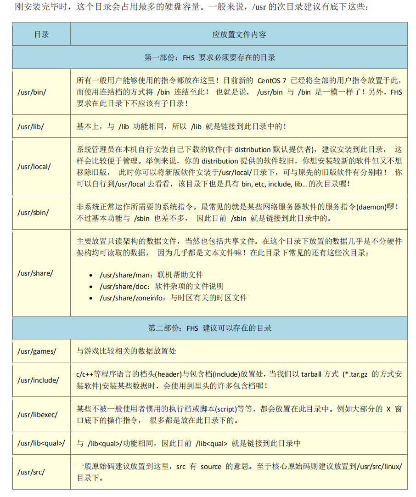

### 文件搜索

1.which

+ 查找执行文件，按照PATH路径查找，
+ `which ls;`列出第一个找到的，`-a`列出所有找到的；

2.whereis

+ 在某些特定目录搜索，速度快;目录包括`/bin`,`/sbin`,`/usr/share/man`等几个特定的目录;
+ 通过`whereis -l`可以确定查找的目录；`-b binary -m manual -s source`;

3.locate

+ 利用数据库搜素`/var/lib/mlocate`，速度块，查找普通文件超好用；
+ 一般操作系统每天会更新数据库，新建的文件可能在数据库中没有，可以通过`sudo updatedb`手动更新；
+ 如`locate note`会将完整路径中带有note的所有列出来；`-i`忽略大小写；
+ 默认不会搜索挂载的硬盘和在`/media`下的分区；

4.find

+ 直接查找磁盘，速度慢；
+ `find . -name *linux*.md`，查找关键文件名；
+ `find: -o(or) -a(and) !(not)`；
+ 基本实例`find /etc -size +1500k -o -size -100k -a -user root -name passwd* -mtime +4 -type d -exec ls -l {} \;`，最后`-exex`执行额外指令不可使用别名；

### 文件属性

`stat filename`
`pwd -P`：显示真实路径而不是链接路径
`basename dirname`

`-rwxrwxr--` ：第一个标志表示文件类型， `-` 表示文件， `d` 表示目录， `l` 表示连接， `b` （block）表示存储接口设备硬盘软盘等， `c` （character）表示串口设备键盘鼠标等，后两个一般在 `/dev` 下。

`chown root:root test.txt`
`chmod u=rwx,go=rx test.txt`

`umask -S`：拿掉属性，用于设置建立文件时的权限默认值

对于目录来说，执行权限的意义代表用户能否进入该目录成为工作目录。

`-` 表示常规文件，一般可分为三种ASCII文件（可直接读到内容），binary文件（可执行，如cat命令其实就对应一个binary文件），data文件（数据文件）。

文件名一般长度限制255字符，128个中文。

FHS(filesystem hierarchy standard)规范每个特定的目录下面放什么文件。

| shareable | unshareable |     |
|-----------|-------------|-----|
| /usr      | /etc        |     |
| /opt      | /boot        |     |

+ `/`：根目录，所有目录由根目录衍生，且根目录与开机、还原、系统修复等有关，所以该目录+ 越小越好。
+ `/bin`目录放置的是单人维护模式下还可以被操作的命令，可以被root和其他用户使用，如+ cat,ls,chown,bash等。
+ `/boot/`开机文件。
+ `/dev`设备文件。
+ `/etc`系统配置文件，只有root用户可以修改。
+ `/lib`系统开机时用到的函数库或者其他应用指令用到的函数库。
+ `/media`光盘，dvd等。
+ `/opt`第三方协助软件，可以理解为第三方系统工具，如KDE等。
+ `/usr/local`自己安装的软件。
+ `/sbin`是root用户用来设置系统环境的命令，包括开机，修复，还原等。
+ `/tmp`一般用户或正在运行的程序放置临时文件。

[目录树](../img/filesystem.png)

### 文件查看

+ `cat -n`：列出行号
+ `tac`
+ `less`
+ `tail -n 20`：最后20行
+ `tail -n +100`：100行后
+ `tail -f`：持续输出

### 文件系统管理

+ `df -h .`：查看文件系统的使用情况,`-i`以inode数量显示
+ `du -sh ./*`：查看每个文件夹情况，`-a`
+ `df -T`：查看文件系统，`parted`：进入parted环境，按p；

实体连接：通过inode进行连接，不产生新的文件，不消耗inode和block；
符号连接：产生新的文件，并消耗inode和block，类似快捷方式。

### 中文编码

`/etc/locale.conf`

### 详解/etc目录

`/etc/init.d/`：系统服务启动的接口目录，新一代系统使用systemd取代；
`/etc/man.conf`：配置man page的搜索路径；
`/etc/shells`：有效的shell；
`/etc/sudoers`:是否具有sudo执行权限；
`/etc/services`：网络服务，端口分配

### 详解/usr目录

