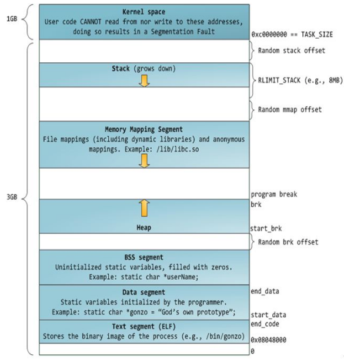

## 进程的内存空间：TEXT, DATA, BSS, HEAP, STACK

1. TEXT段：程序的代码和常量；
2. DATA段：初始化的静态变量和全局变量；
3. BSS段(Block Started by Symbol)：存放初始化的全局变量和静态变量。特点是可读写，在程序执行之前BSS段自动清零，所以未初始化的全局变量程序执行前为0。
4. HEAP段：动态内存区域，使用malloc或new申请的内存，手动申请和释放；
5. 未使用的内存
6. STACK段：局部变量、临时变量、参数、返回值、函数的返回指针，函数执行出栈入栈，自动分配和自动释放。
7. rodata段：存放字符串常量，如”hello“，和`#define`定义的常量。
8. 常量段：一般包含编译器产生的一些数据，如`a=2+3`，则存一个常量5。

内存映射段：将文件内容直接映射到内存，是一种方便高效的文件I/O方式，常用来加载动态库。创建一个不对应于任何文件的匿名内存映射也是可能的，此方法用于存放程序的数据。在Linux中，如果你通过malloc()请求一大块内存，C运行库将会创建这这样一个匿名映射而不是使用堆内存。“大块”意味着比MMAP_THRESHOLD还大，缺省128KB，可以通过mallocp()调整。

### 堆栈对比

| --- |  栈  |  堆  |
| --- | --- | --- |
| 方式 | 编译器自动管理 | 由程序员控制 |
| 大小 | 最大容量是预先设定，获得空间较小 | 不连续的链表分配 |
| 碎片 | 无 | 可能产生大量碎片 |
| 增长方向 | 向下，地址减小 | 向上，地址增加 |
| 效率 | 操作系统在底层提供支持 | 由c/c++库提供分配 |

参考：<https://blog.csdn.net/yusiguyuan/article/details/45155035>