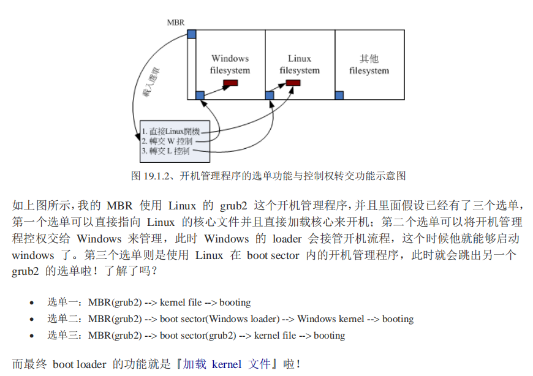
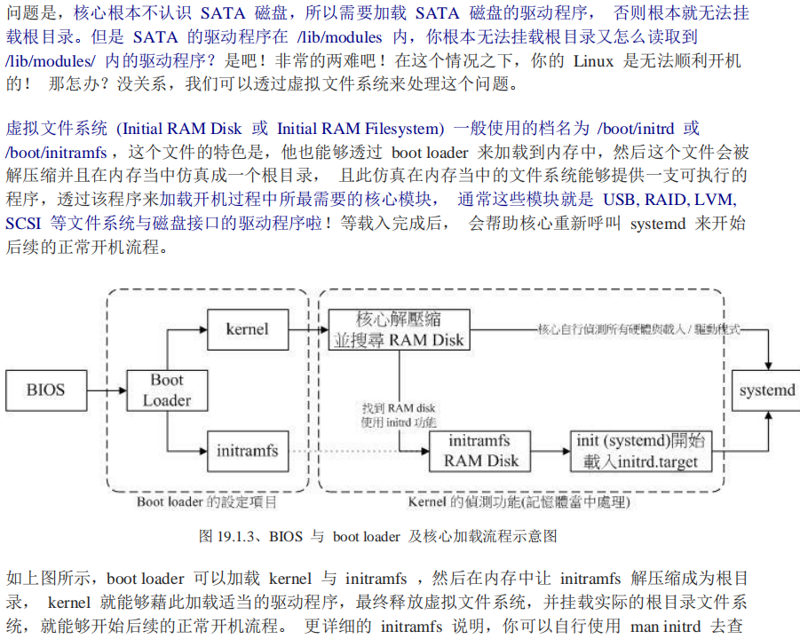

# 选读

## 基本

1.加强shell操作熟练度
2.linux不同发行版本的异同？
同：使用kernal.org释放的核心；支持同样的标准；使用几乎相同的自由软件；几乎相同的操作接口；
异：核心和软件版本可能不同；开发商加入的工具不同；使用的套件管理模式不同（rpm,dpkg）
3.帮助：man ls, info ls, ls --help
4.tab补全，两次tab查看匹配指令列表

## 命令

gdisk针对GPT分区，fdisk针对MBR分区。

## 文件系统

权限：用户，群组，其他人

文件类型：`d`:目录，`-`:文件，`l`:link file,`b`:可存储装置(硬盘)，`c`：串行接口设备（键鼠），`s`:socket,`p`:pipe

权限：rwx,对于文件rwx表示对文件内容的权限，对于目录read表示能访问目录结构（ls），w表示能够创建，删除，命名，移动文件，x表示用户能进入该目录作为工作目录（即cd，无法切换到目录则无法执行该目录下的任何指令），目录不能执行。要开放目录给别人浏览至少给予r和x权限，但w权限不能随便给。

inode:连接到该inode的档名数

`chgrp group file;` `chown user file;` `chown .group file` `chown user:group file;`
`ls -al filename` `chmod 777 file;` `chmod a+x file;`

命名限制255字节以内，128个中字。

FHS:filesystem hierarchy standard，目录配置标准。

可分享，不可分享，不变，可变

+ /:与系统开机、还原、修复有关，越小越好；
+ /usr：与软件有关；
+ /var：与系统运行有关；

[文件目录结构](./img/filesystem.png)

查看文件内容：cat,tac,more,less,head,tail,nl
目录：cd,pwd,mkdir,rmdir

`mkdir -p /a/b/c;` 建立多层目录 `rm -r test;` 删除目录及文件
`echo $PATH;` `PATH="${PATH}:/root"` 添加路径/root到PATH变量
`ls -dl;`查看本身 `ls -i test.txt;`查看inode号
`head -n 10 test.txt;`
`file test` 查看文件类型
`stat test.txt;` 查看文件状态
[`tree`](https://blog.csdn.net/fangye945a/article/details/85256003)

cp，rm,mv，basename,dirname,

cp时注意：

+ 是否需要完整保留来源文件信息？
+ 来源文件是否为符号连接文件？
+ 来源文件是否是特殊文件，如socket?
+ 来源文件是否为目录？

touch:常用于创建空文件或将文件事件修改为当前

umask:指定目前用户在建立文件或目录时的默认权限； `umask; umask -S; umask 002;`

### 文件搜索

which:查找脚本文件，按照PATH路径查找，`which ls;`
whereis:在某些特定目录搜索，速度快
locate:利用数据库搜素，速度块
find:直接查找磁盘，速度慢

find: -o(or) -a(and) !(not)

`find /etc -size +1500k -o -size -100k -a -user root -name passwd* -mtime +4 -type d -exec ls -l {} \; ` 

### 磁盘文件

superblock:记录此文件系统的整体信息，包括inode/block的总量、使用量、剩余量以及文件系统的格式和相关信息；
inode:记录文件的属性，一个文件占用一个iNode，同时记录此文件的数据所在的block号码；
block:实际记录文件的内容，若文件太大时，则会占用多个block;
block group:区块群组，将文件系统分为多个block group，每个block group都有独立的superblock/inode/block系统。
block bitmap区块对照表：记录block是否使用
inode bitmap inode对照表

[文件系统的物理存储](./img/fileblock.png)

限制：原则上block的大小和数量在格式化时确定不可修改；每个block只能存一个文件；大文件存多个block;小文件也会占用一个block;**因此如果单个block过大，则小文件浪费存储资源；如果block过小，则大文件inode记录很多，读写管理不便，一般是4K**，inode的大小一般为**128字节**或256字节，由于inode大小固定，所以当一个文件需要记录的block号过多时，需要使用二级记录，即借用block来记录区块号，甚至有三级的。

`stat test.txt;` `ls -i test.txt;` `df -i;`

**文件名只是inode便于识别的别称，用户通过文件名打开文件，实际上分三步：首先找到文件名对应的inode号码；其次通过inode号码获取inode信息就；最后根据inode信息从block读取数据。**

目录也是一种文件，结构简单，就是一系列目录项的列表。每个目录项包括文件名以及inode号。

硬连接：指向inode号码，创建硬连接则**指向**该inode的文件名总数（链接数）加一。
创建硬链接：`ln 源文件 目标文件`，[目录不能创建硬链接](https://www.zhihu.com/question/50223526)
软连接：内容是文件的路劲，链接数不会改变。
创建软链接：`ln -s 源文件/目录 目标文件/目录`

创建一个文件，则硬连接数为1；创建一个文件夹时，默认生成两个目录项"."和".."，因为可以通过“.”访问，初始硬连接数为2，如果创建子目录，因为子目录生成了".."项，所以目录的硬链接数加1。所以任何一个目录的硬链接数等于2加上子目录数（含隐藏目录）。

好处：移动文件或重命名不影响inode;可以通过直接删除inode删除文件；可以在不关闭软件的情况下更新，生成新的inode，旧的回收。

`ll -sh`可以查看文件大小以及使用的block大小

### 日志式文件系统

保证ext文件系统的一致性，用于错误恢复；写文件时写日志，类似mysql redo日志。
**断电宕机等非正常关机可能导致文件系统不一致，重启后可能花很长事件做磁盘检查，甚至导致文件系统损坏（非硬件损坏）。**

### swap内存置换空间

早期内存不足时，可以暂时将内存的程序放到磁盘的swap空间。现在内存一般比较大，swap很少用到，因此在个人使用时，不设定swap也可以，但对服务器一般都设置，有备无患。

### 分区，格式化和挂载

gdisk建立新的分区，partprobe强制核心更新分区表，mkfs格式化，mkdir建立挂载点，mount挂载。

+ `fdisk -l`
+ `df -hT`
+ `parted /dev/sda` `print list`

### 压缩打包

<https://blog.51cto.com/chidongting/1744575>

### [备份](http://os.51cto.com/art/201005/200285_all.htm)

dd:系统复制，将iso写入U盘实例
sudo fdisk -l查看Ｕ盘的路径: /dev/sdb1
sudo dd if=/home/user/ubuntu-14.04.5-desktop-amd64.iso of=/dev/sdb1

## bash

~/.bash_history记录的是上一次登录以前执行过的命令，至于这一次登录执行的命令暂存在内存中，当成功注销后才写入.bash_history文件中。`history`

`alias lm='ls -al'`别名

`type`判断是否为bash内建指令

`\[Enter]` 长命令换行，中间不能有空格

[快捷键](https://github.com/hokein/Wiki/wiki/Bash-Shell%E5%B8%B8%E7%94%A8%E5%BF%AB%E6%8D%B7%E9%94%AE)

变量：`env` `$PATH` `${PATH}`

`echo $$` 本shell的PID

set-unset alias-unalias

`!66` 执行history中66号命令

### 数据流重定向

## 开机管理boot loader

开机流程：

1. 加载bios的硬件信息并进行自我测试，并根据设定取得第一个可开机设置；
2. 读取和执行第一个开机装置内MBR（主引导记录）的boot loader(一般是grub2)；
3. 依据boot loader的设定加载kernal，kernal会开始侦测硬件和加载驱动程序；
4. 在硬件驱动成功后，kernal会主动启动systemd程序，并以default.target流程开机；

### boot loader

BIOS：传统bios或者uefi bios;
[MBR](http://c.biancheng.net/view/1015.html)：传统MBR或者新式GPT，代表磁盘最前面可安装boot loader的区块；注意Windows的loader不能加载linux的loader。所以一般先安装Windows，再安装linux，这样最后是linux的loader覆盖了，还能再调出Windows的。当然如果不小心先装了linux再装了Windows，那么最后要手动再安装grub，保证MBR中安装的是linuxde loader。

BIOS和CMOS：BIOS是一段程序，这段程序需要读取的数据存在一个ram上，这个ram就是CMOS。

boot loader读取到核心文件后，解压到主存执行，然后核心接管BIOS的工作。linux核心会以自己的功能重新侦测一次硬件，而不一定使用BIOS侦测到的硬件信息。核心一般放在/boot目录下，取名为`/boot/vmlinuz`。linux核心通过动态加载核心模块（类似驱动程序），核心模块放在`/lib/modules`目录内。`/lib`和`/`必须在同一分区，开机过程中核心必须挂载根目录，才能读取核心模块。

systemd开机流程大约是：

1. local-fs。target + swap.target：这两个target主要是挂载`/etc/fstab`里面所规范的文件系统和相关的swap空间；
2. sysinit.target：主要是侦测硬件，加载所需要的核心模块等；
3. basic.target：加载主要的外围硬件驱动与防火墙相关的加载；
4. multi-user.target底下其他一般系统或网络服务加载；
5. 图形界面；

核心模块：`/etc/modules-load.d/*.conf`，`/etc/modprobe.d/*.conf`
核心参数：`/etc/sysctl.conf`和`/etc/sysctl.d/*.conf`

### 核心相关命令

depmod, modprobe, lsmod, modinfo, rmmod, insmod,

## 其他

网络设定：nmcli(network manager client)，hostnamectl
时间设定：timedatectl
语言设定：localctl
防火墙设定：firewall-cmd
硬件解析：dmidecode
硬件侦测指令：gdisk，dmesg, vmstat, lspci, lsusb, iostat
动态链接库解析：ldd

rp-pppoe-3.11-5.e17.x86_64.rpm
软件名-版本-打包数.支持硬件平台.后缀名

`/var/lib/rpm`：rpm安装软件后，会将软件相关信息写入该目录，下次安装或查询都要读该目录；
`rpm -ivh ***.rpm`：-i install, -v 查看安装信息， -h 进度； -U 更新；

基本上rpm指令只剩下查询和校验功能，安装使用yum。
rpm查询：

+ -q：查询后面接的软件是否安装；
+ -qa：查询所有安装的软甲；
+ -qi：查询该软件的详细信息；
+ -ql：查询该软件的所有文件和目录；
+ -qc：查询该软件的配置文件；
+ -qd：查询该软件的文档说明；
+ -qR：查询该软件依赖软件的包含文件；

+ -qp[icdlR]：查看某个rpm文件的信息，而不是安装软件信息；

yum查询：`yum [list|info|search|provides]`
安装升级移除：`yum [install | update | remove]`
查看软件库：`yum repolist all`
删除所有下载过的软件库数据：`yum clean all`

x server | x client | windows manager

centos 7网卡命名：
规则1：

对于板载设备命名合并固件或 BIOS 提供的索引号，如果来自固件或 BIOS 的信息可读就命名，比如eno1，这种命名是比较常见的，否则使用规则2。

规则2：

命名合并固件或 BIOS 提供的 PCI-E 热插拔口索引号，比如 ens1，如果信息可读就使用，否则使用规则3。

规则3：

命名合并硬件接口的物理位置，比如 enp2s0，可用就命名，失败直接到方案5。

规则4：

命名合并接口的 MAC 地址，比如 enx78e7d1ea46da，默认不使用，除非用户选择使用此方案。

规则5：

使用传统的方案，如果所有的方案都失败，使用类似 eth0 这样的样式。

