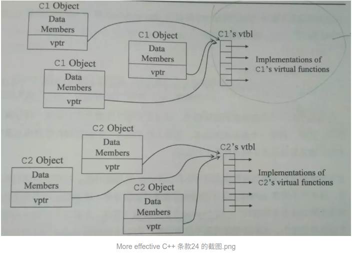
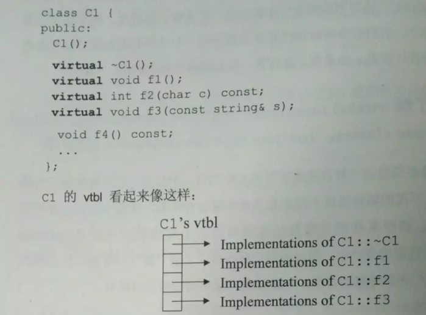
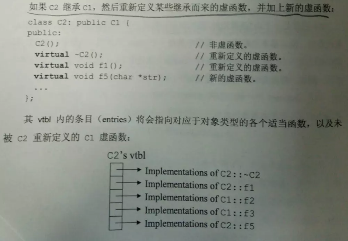

### 多态

多态，即多种状态（形态）。简单来说，我们可以将多态定义为消息以多种形式显示的能力。多态是以封装和继承为基础的。
常见的场景：**基类的指针或引用指向派生类的对象**。

C++ 多态分类及实现：

1. 重载多态（Ad-hoc Polymorphism，编译期）：函数重载、运算符重载
2. 子类型多态（Subtype Polymorphism，运行期）：虚函数
3. 参数多态性（Parametric Polymorphism，编译期）：类模板、函数模板
4. 强制多态（Coercion Polymorphism，编译期/运行期）：基本类型转换、自定义类型转换

### 什么是虚函数？

用`virtual`修饰成员函数，使其成为虚函数，主要用于实现多态，动态绑定。

1. 非成员函数不能是虚函数
2. static函数不能是函数
3. 构造函数不能是虚函数
4. 内联函数不能是变现多态时的虚函数
5. 类（无论普通类或模板类）的成员模板（本身是模板的成员函数）不能是虚函数

[vitual关键字什么时候可以不写：隐式继承virtual关键字](https://blog.csdn.net/lincyang/article/details/7794513)

### 析构函数定义为虚函数有什么用？构造函数可以是虚函数吗？在构造函数和析构函数里面可以定义虚函数吗？

虚析构函数是为了解决基类的指针指向派生类对象，并用基类的指针删除派生类对象。

构造函数不能是虚函数，因为在调用构造函数时，虚表指针并没有在对象的内存空间中，必须要构造函数调用完成后才会形成虚表指针。  

假设一个派生类的对象进行析构，首先调用了派生类的析构，然后在调用基类的析构时，遇到了一个虚函数，这个时候有两种选择：Plan A是编译器调用这个虚函数的基类版本，那么虚函数则失去了运行时调用正确版本的意义；Plan B是编译器调用这个虚函数的派生类版本，但是此时对象的派生类部分已经完成析构，“数据成员就被视为未定义的值”，这个函数调用会导致未知行为。实际情况中编译器使用的是Plan A，如果虚函数的基类版本不是纯虚实现，不会有严重错误发生，但你依然会困惑虚函数机制失效，说不准又是“一张通往彻夜调试的直达车票”，所以Effective C++建议不要这么干。

### 虚函数是针对对象还是类？虚函数是如何实现的？虚函数指针和虚函数表的关系？

编译器会为每个有虚函数的类创建一个`虚函数表`，该虚函数表将被该类的所有对象共享。类的每个虚成员占据虚函数表中的一行。如果类中有N个虚函数，那么其虚函数表将有N*4字节的大小。类的每个对象都有一个指向虚函数表的指针(`虚指针`)。  
编译器应该是保证虚函数表的指针存在于对象实例中最前面的位置（这是为了保证取到虚函数表的有最高的性能——如果有多层继承或是多重继承的情况下）。 这意味着可以通过对象实例的地址得到这张虚函数表，然后就可以遍历其中函数指针，并调用相应的函数。虚函数表存放的位置不同编译器还不一样。



  
参考：<https://www.jianshu.com/p/5d6edcb3b83e>

### 纯虚函数和虚函数有什么区别？

1.纯虚函数是一种特殊的虚函数，在基类中不能对虚函数给出有意义的实现，而把它声明为纯虚函数`= 0；`，它的实现留给该基类的派生类去做。  
2.虚函数在基类提供实现，在子类可以重载也可以不重载，而纯虚函数只是一个接口，不能在基类提供实现，必须在子类实现。  
3.带有纯虚函数的类称为抽象类，抽象类不能直接生成对象，只有被继承，重写虚函数后才能使用。虚基类：  

### 虚继承和虚基类？菱形继承？

```c++
class CBase { }；
class CDerive1：virtual public CBase{ }；
class CDerive2：virtual public CBase{ }；
class CDerive12：public CDerive1，CDerive2{ }；
```

虚基类是用关键字virtual声明继承的父类，即便该基类在多条链路上被一个子类继承，但是该子类中只包含一个该虚基类的备份，虚基类主要用来解`菱形继承`中的二义性问题，这就是是虚基类的作用所在。  
正是由于虚基类的这个作用，所以在每个子类的构造函数中必须显示的调用该虚基类的构造函数，不管该虚基类是不是直接的父类。  
其次，虚基类的构造函数的调用早于其他非虚基类的构造函数的调用。  

参考：
[多继承，虚继承的内存环境](https://www.oschina.net/translate/cpp-virtual-inheritance)
<https://blog.csdn.net/chlele0105/article/details/22654869>

### 虚函数可以内联吗？

虚函数可以是内联函数，内联是可以修饰虚函数的，但是当虚函数表现多态性的时候不能内联。
内联是在编译器建议编译器内联，而虚函数的多态性在运行期，编译器无法知道运行期调用哪个代码，因此虚函数表现为多态性时（运行期）不可以内联。
inline virtual 唯一可以内联的时候是：编译器知道所调用的对象是哪个类（如 Base::who()），这只有在编译器具有实际对象而不是对象的指针或引用时才会发生。

### 抽象类、接口类、聚合类

抽象类：含有纯虚函数的类
接口类：仅含有纯虚函数的抽象类
聚合类：用户可以直接访问其成员，并且具有特殊的初始化语法形式。满足如下特点：

+ 所有成员都是 public
+ 没有有定于任何构造函数
+ 没有类内初始化
+ 没有基类，也没有 virtual 函数